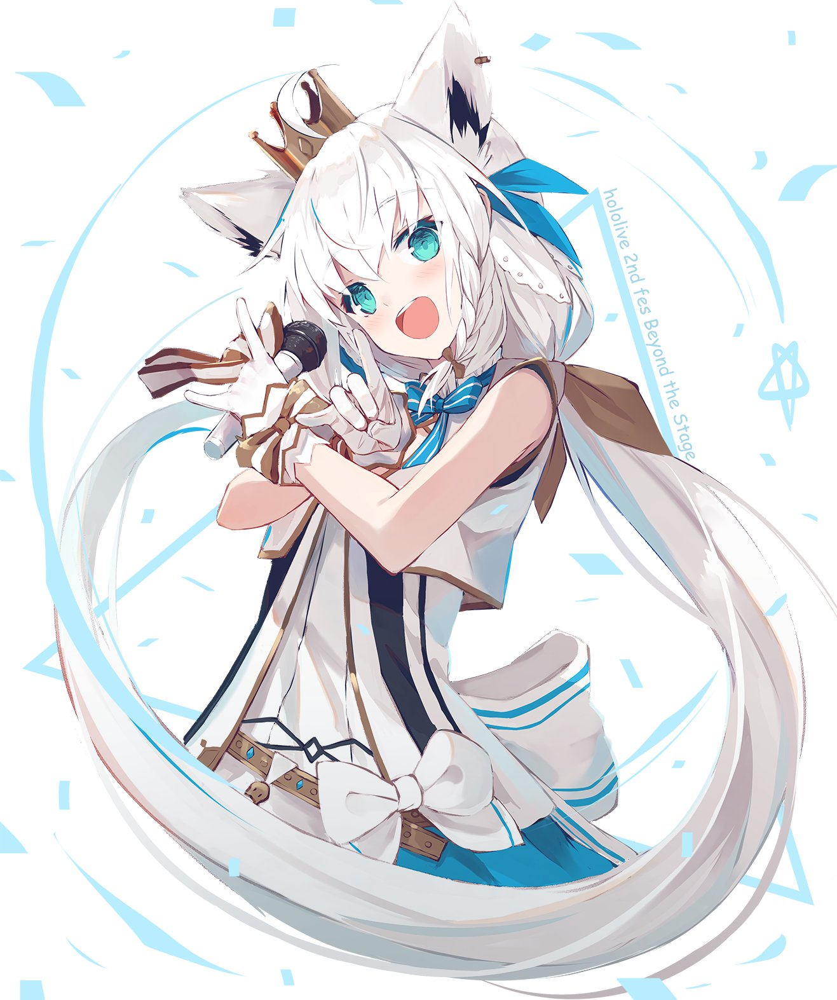

a<h1 align="center">
  <br>
  <a href="https://github.com/ryatan387/Fubuki-Bot.git"></a>
  <br>
  Fubuki Bot
  <br>
</h1>


Discord bot themed around VTuber, Shirakami Fubuki, that plays music and posts art from Pixiv. Also has friendzoning capababilities. 

## How to set it up 
1) Download [Node](https://nodejs.org/en/) and [git](https://git-scm.com/downloads)
2) Clone the repository
```
git clone https://github.com/ryatan387/Fubuki-Bot.git
```
3) Install all the dependencies,
```
- npm i discord.js
- npm i ytdl-core
- npm i pixiv-api-client
- npm i youtube-search
- npm i request
```
4) Add your [DiscordAPI](https://discordapp.com/developers/applications/) token, [YouTubeAPI](https://developers.google.com/youtube/registering_an_application) token, and [Pixiv](https://www.pixiv.net/en/) username and password to the config.json file.
5) Enter directory
```
cd Fubuki-Bot
```
6) Run the application
```
node Fubuki.js
```

## Credits
- https://blog.howlingmoon.dev/posts/How-request-header-can-give-you-access-to-Pixiv-resources-externally
- [Cover art](https://twitter.com/lemon_mito/status/1341222583774035969/photo/1)
